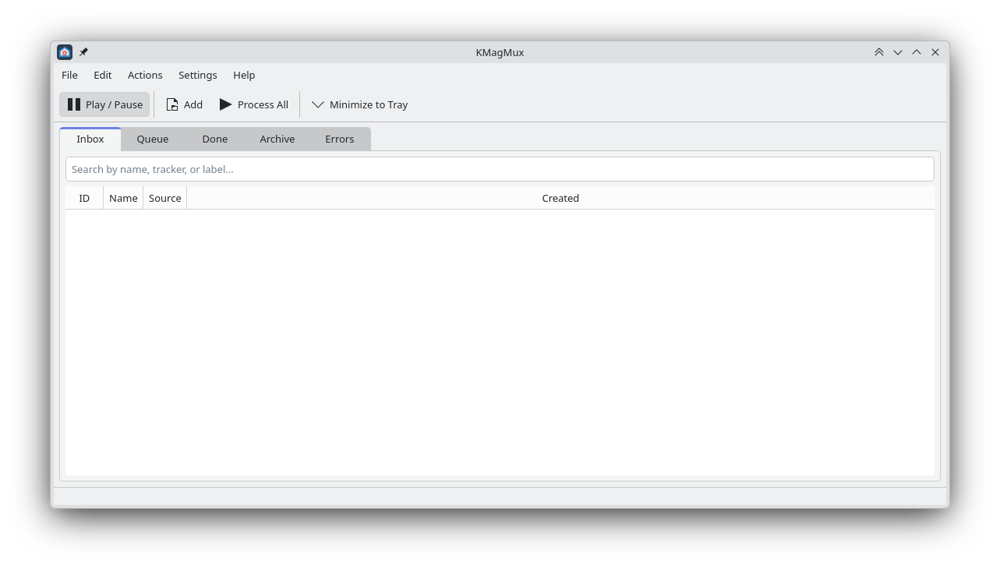
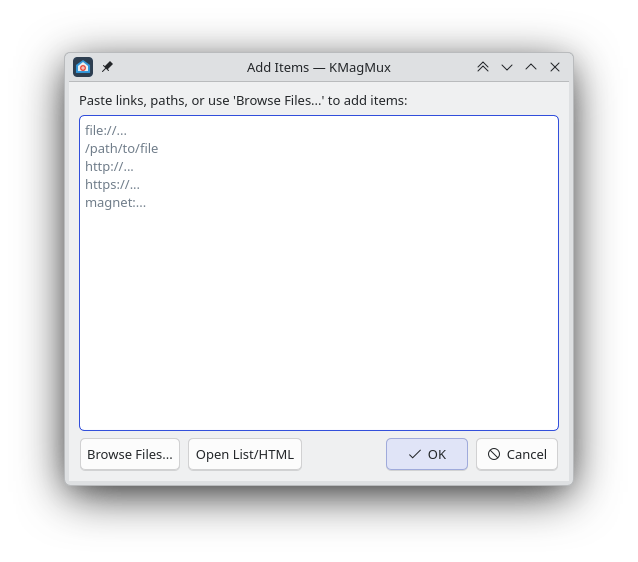
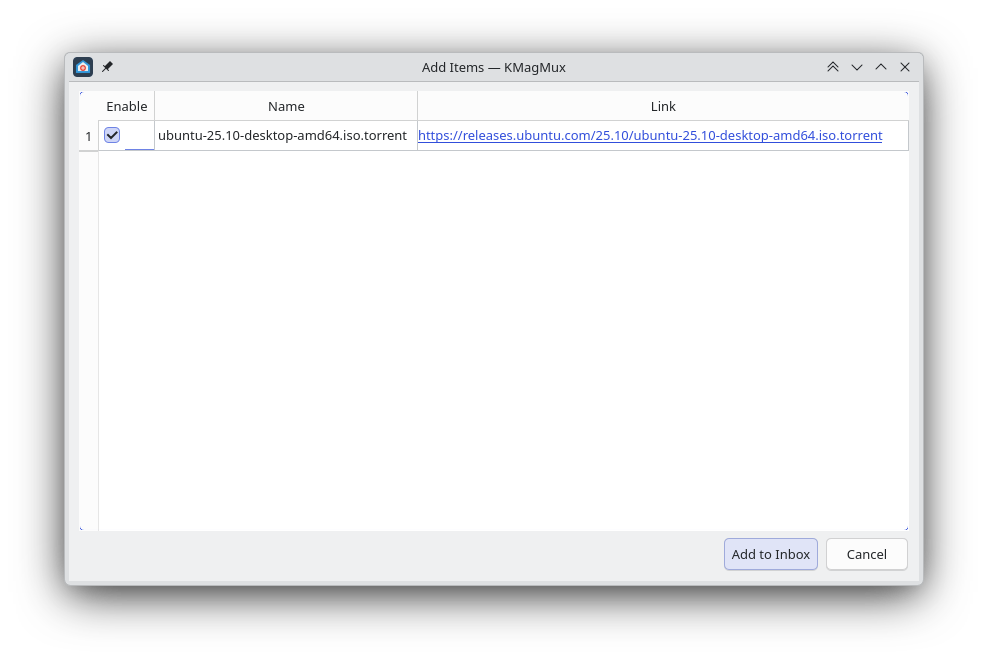
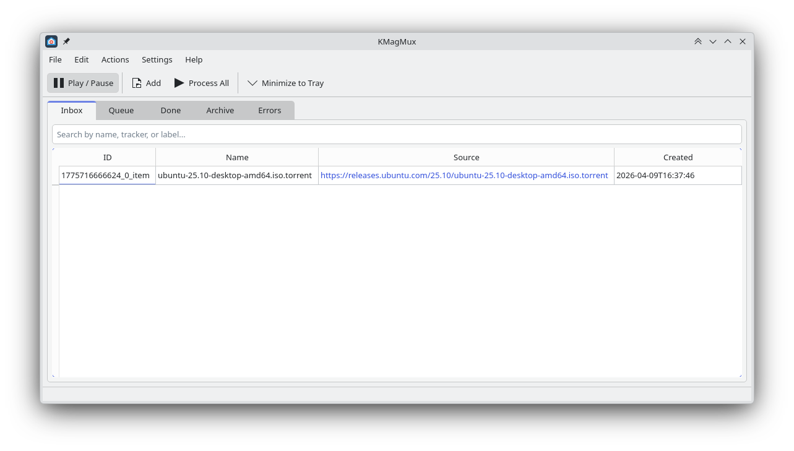
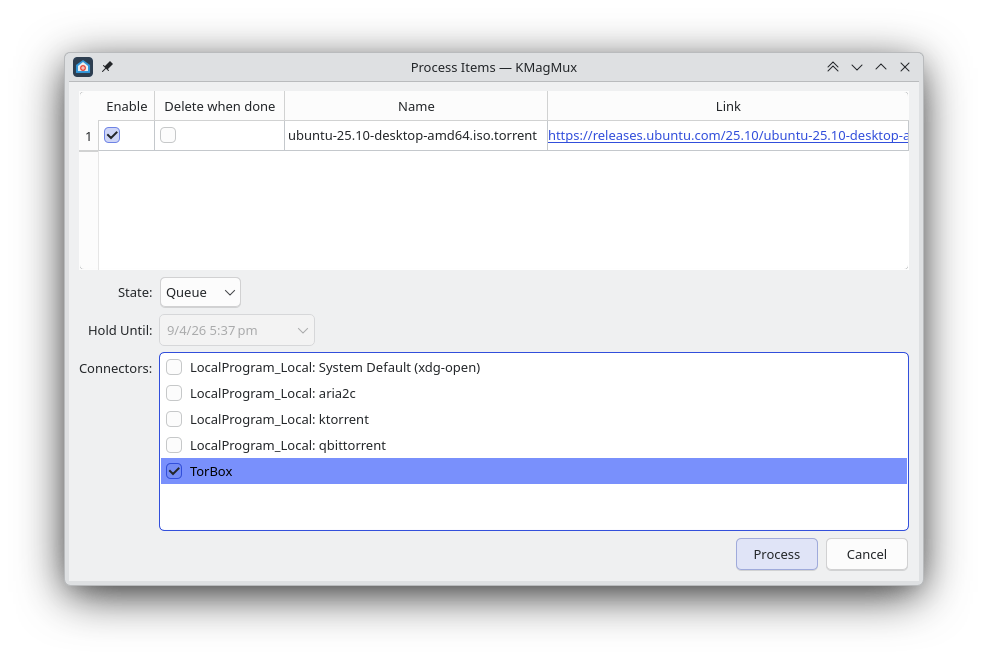
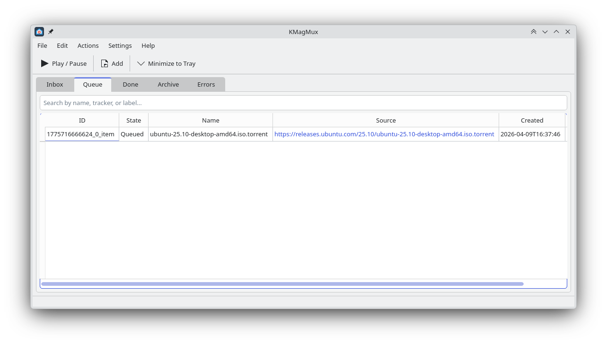
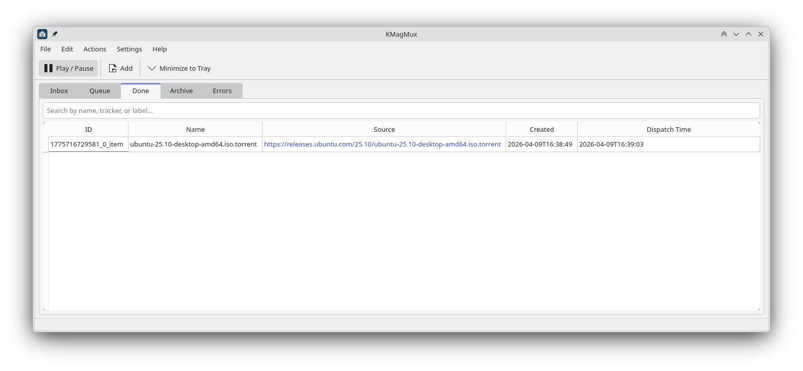
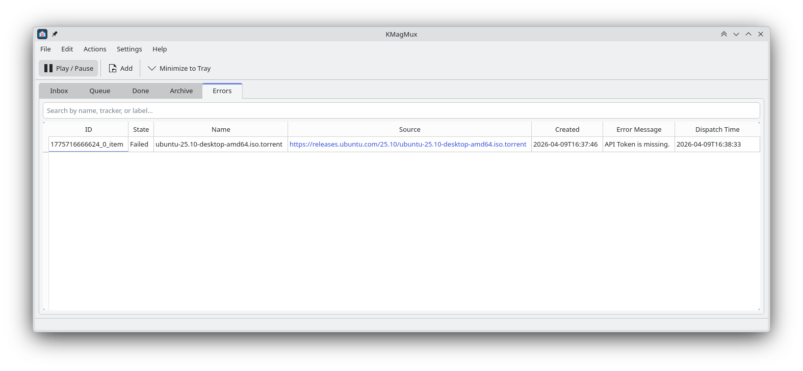
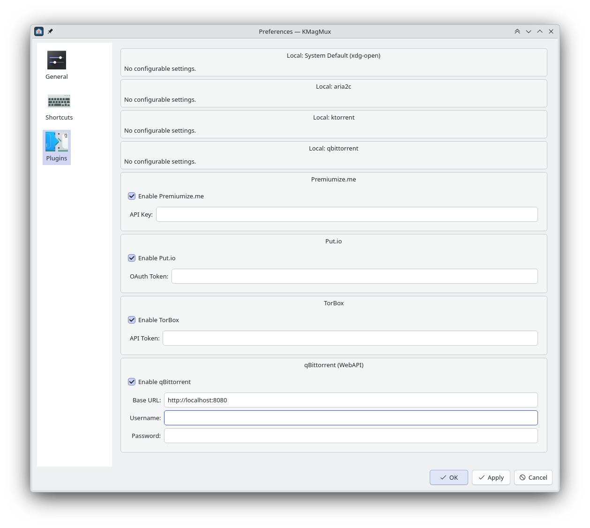
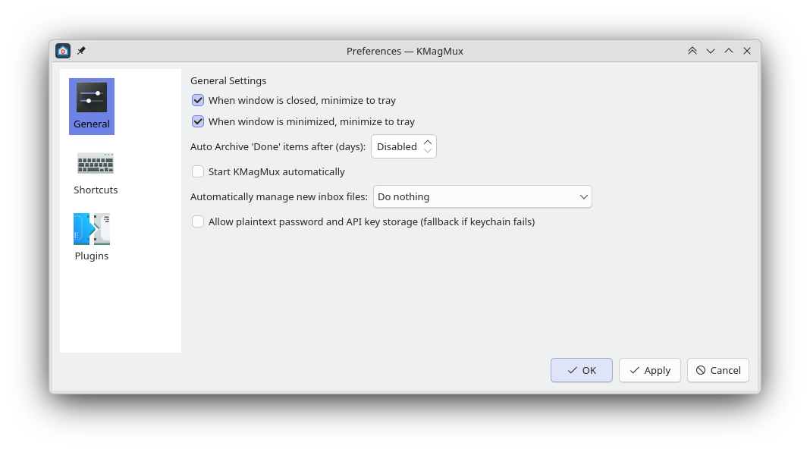

# KMagMux

Torrent file and Magnet link handler for routing to programs / services.

KMagMux is a powerful and flexible router and manager for Torrent files and Magnet links. It allows you to collect links from various sources, review them in an Inbox, and dispatch them to multiple different clients or services based on your preferences.

## Features

### Main Interface
The main window provides a clear overview of all your items categorized into different tabs: Inbox, Queue, Done, Archive, and Errors.

### Adding Items
You can easily add new Torrent files or Magnet links by pasting links, paths, or browsing files directly.

Items added to the Inbox are ready to be reviewed before processing.

### Inbox
The Inbox serves as a staging area. Here you can see the items you've added, verify their details, and select which ones you want to process.

### Processing Items
When you process items from the Inbox, you can select specific destination connectors. Connectors represent the local programs or remote services (e.g., qBittorrent, Premiumize.me, TorBox) where the torrent will be sent.

### Queue Management
Items being processed are placed in the Queue, allowing you to monitor their status as they are dispatched to the selected connectors.

### Done and Archive
Successfully dispatched items are moved to the Done tab. You can configure KMagMux to automatically archive these items after a certain period.

### Error Handling
If any item fails to dispatch (for example, due to a missing API token or connection issue), it will be moved to the Errors tab where you can view the error message and retry if necessary.

### Preferences and Plugins
KMagMux supports a variety of local programs and remote services via plugins. You can configure credentials (API keys, OAuth tokens, passwords) securely for each service.

General settings allow you to customize application behavior such as minimizing to tray, auto-archiving, and managing new inbox files.

## Architecture

KMagMux is built with C++ and Qt6/KF6, ensuring deep integration with the KDE Plasma desktop while remaining cross-platform compatible. Passwords and sensitive data are stored securely using QtKeychain.
